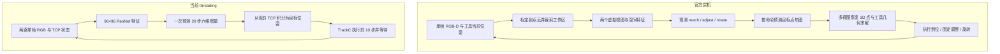

# 原生 ARP 实机方案与当前 threading 实现的对照

本次核对原论文 v5、官方 `real-robot/` 代码、当前 checkpoint 内实际配置，以及当前数据和部署路径。结论：当前模型保留了 ARP 的 CCT 网络基础，但在空间预测、任务表达和执行方式上不同于官方实机。差异不等于必须照搬；当前 threading 的定义是“insert the grasped block into the hole”，按单阶段任务设计。当前拟合问题不能只用 GMM 与 Smooth-L1 的区别解释。**这里的“当前”指 9 月 10 日 RGB checkpoint；9 月 7 日已经实际训练过点云 MVT 版本，不能把点云和空间监督说成从未尝试的新方向。历史补充见文末。**

## 对照对象和证据范围

- 官方仓库审查版本：`mlzxy/arp@73cb339c032b3c350966269f4729bd1f29e927a9`。临时只读检出：`/tmp/arp_upstream_audit_20260910`。
- 论文：[v5 第 4.3 节](https://arxiv.org/html/2410.03132v5#S4.SS3)。对照对象是 Kuka 实机拧螺母任务，不是 ALOHA 仿真 insertion，也不是 Push-T。
- 本地对象：`threading_task.policy.ThreadingARPolicy`，前 50 条实验实际保留的 epoch 63 EMA；其网络、输入和 loss 与此前 80 条实验 epoch 50 同类。
- 本次只检查代码、配置、论文和既有评估，没有复现官方实机成功率，也没有取得官方实机训练数据/预训练模型重新推理。
- 官方提供实机预测可视化 notebook，未在本次审查目录中看到完整硬件控制部署程序；力反馈与调整执行细节按论文/notebook 陈述，不能进一步确认控制频率、增益和延迟。

## 必须更正的理解

之前讨论的“原生 ARP 连续动作使用 GMM NLL”描述的是通用预测头。官方实机 `RobotPolicy` 实际选择的是 **command 分类头和空间热图头**，没有用 GMM 直接回归六维 TCP 增量。

官方目标是先识别 reach / adjust / rotate，再定位工具目标点；当前目标是在单帧 RGB 和 TCP 状态条件下复现未来连续运动。这是监督任务的变化，不只是替换 loss 函数。

## 任务与执行链路

论文报告使用一台 Kuka LBR iiwa，将预先抓好的扳手套入螺母并旋转；工具对准容差为 2 mm。螺栓位置、螺母高度和朝向变化，70 条示范来自 FoundationPose 辅助专家和人工微调。报告普通条件成功 8/10，加入插入平面 ±5 mm 扰动后成功 6/10；成功允许不超过三次对准尝试。上述结果不等于每一步动作都拟合到亚毫米，也不能直接与我们的插孔任务比较。[论文实机实验](https://arxiv.org/html/2410.03132v5#S4.SS3)

官方按动作原语完成任务；我们按 15 Hz 标签时间尺度预测动作，用户当前命令执行 10 步，名义覆盖约 0.667 秒，完整预测覆盖约 1.333 秒。同步等待和推理会影响实际周期，不能把 15 Hz 当作每秒重新观察 15 次。两种模式都可以闭环，但闭环层级不同。

## 输入、视觉与动作表示

| 项目 | 官方实机 | 当前使用的 checkpoint |
|---|---|---|
| 物理相机 | 单个 RealSense D415，480×640 RGB-D | cam1、cam3 两台固定相机，仅 RGB |
| 模型视觉 | 标定 RGB-D 点云，裁剪到固定工作区，再渲染 top/left 虚拟视图 | 两路图像整幅缩放，训练文件 224×224，模型输入 96×96 |
| 几何信息 | 渲染点坐标、颜色、深度和位置通道，共 10 通道 | RGB 三通道；相机/行列位置 embedding 不提供标定几何 |
| 空间网格 | 每视图 420×420，patch 14，因此 30×30；合计 1800 个空间 token | 每视图 ResNet stride 32 后为 3×3；合计 18 个空间 token |
| 当前状态 | 工具和可见夹爪参考点在虚拟视图中的投影 | TCP xyz、旋转矩阵前两列、夹爪宽度，共 10 维 |
| 历史 | 该实机实现使用当前阶段观测 | 当前单帧，无历史图像或速度 |
| 动作 | 命令 + 目标工具/夹爪点；旋转阶段预测 6 个夹爪轨迹点 | 20 个 `[dx,dy,dz,drotvec]`，夹爪固定 |
| 位姿恢复 | 工具标定变换、3D 目标点及几何优化 | 增量在基座坐标系累积，旋转增量左乘 |
| 语言、腕部相机 | 该实机模型无语言输入；物理相机为单个外部 RGB-D | 无语言、无 wrist |

官方空间预测及 token 定义见 [network.py](https://github.com/mlzxy/arp/blob/73cb339c032b3c350966269f4729bd1f29e927a9/real-robot/network.py#L38-L109)，点云裁剪见 [dataset.py](https://github.com/mlzxy/arp/blob/73cb339c032b3c350966269f4729bd1f29e927a9/real-robot/dataset.py#L201-L240)。本地见 `threading_task/policy.py` 的 `_visual_tokens` 和 checkpoint 的 shape_meta。

1800 与 18 是空间 token 数量的比较，不是精度倍数，也不意味着当前模型只能定位到 32 像素。当前编码器仍可能在通道内保存细节，但其空间表示和监督显著不同。原生实机本身也用单帧，所以不能仅凭它的成功就要求恢复历史帧或改用 joint 输入。

归一化也不同：官方将点云和控制点放入同一工作区坐标立方体，再投影成像素位置；当前状态和动作分别按训练集逐维 min/max 做线性归一化。官方的位置监督由标定几何决定，当前六维误差权重还受到各动作轴统计范围影响。当前归一化中的常量夹爪不会进入六维回归 loss。

## 数据标签和采样

| 项目 | 官方实机 | 当前实现 |
|---|---|---|
| 训练样本单位 | 初始 reach、失败后 adjust、开始 rotate 等阶段状态 | 固定 15 Hz 的每个连续观测窗口 |
| reach 标签 | 使用调整后成功的插入目标，修正初始 reach 监督 | 无 reach 标签，直接使用下一时刻实测 TCP 位移 |
| adjust 标签 | 显式恢复状态及工具调整目标点 | 调整动作隐含在连续示范中，无阶段标注 |
| 采样 | reach / 左调 / rotate / 右调 概率为 0.27 / 0.27 / 0.27 / 0.19 | 训练窗口随机打乱；没有按任务阶段均衡 |
| 时序处理 | 关键阶段提取，rotate 最多取前 6 个目标点 | 同一时间网格插值关节、相机独立最近邻匹配；保留小动作与等待 |
| 监督语义 | 工具应到达哪里，以及该执行哪类动作 | 从端实际上怎样移动 |

标签修正和阶段采样均可在 [官方 dataset.py](https://github.com/mlzxy/arp/blob/73cb339c032b3c350966269f4729bd1f29e927a9/real-robot/dataset.py#L65-L131) 及其 `get` 方法确认。本地标签在 `scripts/build_arp_continuous_dataset.py` 由相邻实测关节 FK 生成。

这提供了一个更明确的区别：原版主动给模型“成功目标”的监督，并让调整样本反复出现。我们的示范若包含等待和往返，它们仍是需要拟合的标签。这里不能进一步推断示范质量差，也不能未经检查将全部未来目标替换成同一个最终位姿。

官方配置实际枚举 **69 条训练、10 条验证**，论文写 70 条训练示范，二者存在一条差异，本次未获得原始数据解释原因。本地前 50 条范围内是 40 训练 / 10 验证；旧 80 条是 64 / 16。两者均不能通过 episode 数直接衡量监督量和难度。

## 网络、训练和增强

| 项目 | 官方实机配置与实际代码 | 当前前 50 条实验 |
|---|---|---|
| 视觉编码器 | MVT 风格：点云渲染 + 8 层 ViT，hidden 128 | ImageNet ResNet18，BatchNorm 替换为 GroupNorm，可训练 |
| ARP 层 | 4 层、hidden 128、8 heads、AdaLN | 6 层、hidden 64、8 heads、AdaLN |
| 生成结构 | 先 command；reach 先工具点，再条件生成夹爪点；其余按命令生成 | `plan_steps=0`，20 个 fine-action 在同一个 chunk 一次生成 |
| 优化器 | LAMB，betas=(0.9,0.999) | AdamW，betas=(0.95,0.999) |
| 实际初始目标 LR | YAML 5e-5 被 train.py 乘 batch 16，即 8e-4 | ARP/投影 5e-5；视觉编码器 1e-6 |
| Batch | 16 | 64 |
| 预算 | 50000 iterations；作者 notebook 选择验证最优的 iteration 3000 | 80 epochs；各轮完整验证 |
| Warmup / 调度 | 1000 updates，cosine，最低为峰值 LR / 100 | 100 updates，cosine |
| Weight decay | 1e-4 | ARP 1e-3；视觉与投影等 1e-6 |
| EMA / 混合精度 | 该 train/network 路径未使用 EMA；使用 AMP | 使用 EMA；当前训练代码没有对应 AMP 路径 |
| 正则 | dropout 0.1 | dropout 0.1 |
| 数据增强 | 对点云、当前工具点和目标点同时施加 SE(3) 变换 | brightness 0.2、contrast 0.2、saturation 0.15、hue 0.03、noise 0.015；图像平移 0 |

参数来自 [官方 config.yaml](https://github.com/mlzxy/arp/blob/73cb339c032b3c350966269f4729bd1f29e927a9/real-robot/config.yaml)、[train.py 的学习率缩放](https://github.com/mlzxy/arp/blob/73cb339c032b3c350966269f4729bd1f29e927a9/real-robot/train.py#L33-L39) 和 [network.py 的优化器](https://github.com/mlzxy/arp/blob/73cb339c032b3c350966269f4729bd1f29e927a9/real-robot/network.py#L111-L139)。本地参数直接读取实测 checkpoint 内 cfg，避免混入旧配置。

官方平移增强 `[0.1,0.05,0.05]` 是工作区边长的比例，不是米；其工作区尺寸对应约 ±24、±11.5、±9 mm 的最大平移采样范围，边界还会约束实际变换。旋转配置 `[0,0,45]` 表示 Z 轴 ±45°。这属于带一致标签变换的几何增强，与调亮/调暗 RGB 有本质区别。[增强实现](https://github.com/mlzxy/arp/blob/73cb339c032b3c350966269f4729bd1f29e927a9/real-robot/utils/preprocess.py#L654-L745)

学习率不能跨优化器和表示直接照抄。当前视觉 LR 很小，是可检验的优化因素，但尚未通过受控实验证明它导致欠拟合。官方选择 iteration 3000 也不意味着我们的 dense-window 任务训练 3000 步即可完成。

## 官方实机的 loss 到底是什么

官方 `RobotPolicy.forward_train` 按 token 类型生成 loss 后相加：

- command：3 类交叉熵。
- reach：工具目标点、夹爪目标点的空间交叉熵。
- adjust：调整后工具点的空间交叉熵。
- rotate：6 个轨迹点、两个虚拟视图对应的空间交叉熵。

目标热图使用 sigma=1.5 像素的高斯软标签，截断于 3 sigma；各分支 loss 各自平均后相加，批内不存在的阶段没有该项。对应 [network.py 的监督构造](https://github.com/mlzxy/arp/blob/73cb339c032b3c350966269f4729bd1f29e927a9/real-robot/network.py#L256-L380) 和 [空间预测头](https://github.com/mlzxy/arp/blob/73cb339c032b3c350966269f4729bd1f29e927a9/arp.py#L928-L987)。

当前则是归一化六维动作的 Smooth-L1(beta=0.1)，对有效 token 和维度平均；没有阶段分类、目标热图或累计位移项。不能仅将函数名换成 CrossEntropy 就得到原方案：它需要空间标签、预测头以及几何解码链路。

当前 `action_chunk_size=20`、horizon=20、plan_steps=0，意味着未来动作间没有多个 chunk 的逐段生成。这仍是 CCT 的一种有效配置，但未使用官方实机的“命令 → 工具目标 → 夹爪目标”条件分解。部署 `execute_steps=10` 只改变执行长度，不会自动产生这样的层级。

## 控制与反馈的边界

官方明确说明网络不把力作为输入；力反馈在阻抗控制器中用于停止失败插入。其 notebook 还说明，adjust 预测点最终被转换为左右方向，实机每次固定移动 3 mm。即网络并不负责精确回归每次调整幅度。[作者实机说明](https://github.com/mlzxy/arp/blob/73cb339c032b3c350966269f4729bd1f29e927a9/real-robot/readme.ipynb)

当前脚本将模型输出从实测 TCP 位姿积分，通过 TrackC 发送目标，支持运动限幅、工作区约束与同步到位检查。审查的策略执行路径没有对应的、任务级“失败插入 → 专门调整 → 重试”原语；不能因此断言底层机器人完全没有力反馈或碰撞保护。

控制器差异可能影响实机成功率，但不能解释我们已经测出的训练集离线预测误差。原生推理也不是必须每次采高斯噪声：实机空间预测 callback 通过热图选择最可能的 3D 点，再投影给后续预测。

## 对当前问题的优先判断

1. **优先检查目标区域的视觉有效分辨率。** 当前 RGB 整幅降至 96×96；旧 MVT 虽为 420×420，但工作区较大。先验证方块与孔的细节在模型实际输入中是否保留，再做高分辨率或合理工作区裁剪的受控对照。现有误差尚不能单独证明视觉分辨率是唯一根因。
2. **保持单阶段，检查空间目标监督与训练拟合。** 无需增加 reach / adjust / rotate 分类。单阶段同样可以使用工具目标点热图或连续动作监督；应分别验证完整单轨迹和多轨迹的定位、位移、方向误差。
3. **loss 修改应服务于明确目标。** 保留当前 dense 动作时，可测试平移/旋转分离与累计位移监督；若采用空间预测，应建立工具目标点及几何解码。空间监督不要求额外的阶段标签。
4. **优化预算是次一级的受控变量。** 比较相同训练窗口、固定随机种子和更新数，逐项测试视觉 LR、空间分辨率或损失，避免同时变化后无法归因。
5. **实机闭环恢复在离线拟合后单独验证。** 原版的固定调整与力触发机制不证明我们的模型已学会动作，也不能用新增控制规则掩盖训练集预测错误。

已有事实：本地 epoch 63 EMA 对 40 条训练轨迹的首步误差 0.861 mm、10 步累计误差 5.896 mm，首步方向误差 28.39°。末段有明显运动的窗口，10 步方向误差 65.93°。这些支持继续查训练拟合，不能证明示范质量差或某项架构差异就是根因。详见 `doc/ARP_FIRST50_FIT_CHECK_20260910.md`。

保持用户已选定的单帧 TCP 输入，可以先完成完整单轨迹记忆实验，再做多轨迹对照；如果引入空间监督，应优先检查现有视频、FK、相机/工具标定能否生成可靠标签，仅补缺失标注，不预设必须重新采集数据。不能把几何上不适定的两点位姿恢复不加审查地移植到任意工具和六自由度任务。

仓库另有 `mvt_arp_policy.py`、`spatial_policy.py` 等实验实现，但当前 checkpoint 的 `_target_` 是 `threading_task.policy.ThreadingARPolicy`，不经过这些空间预测分支。本次未将它们作为已验证方案，也未修改训练或部署代码。

审查快照保存在 `artifacts/arp_native_real_robot_comparison_20260910/manifest.json`，包含官方 commit、所读文件 SHA256、官方配置、当前 checkpoint SHA256 和解析后的本地配置。

## 用户提醒后补查：我们确实训练过点云 MVT

之前的对照没有展开历史点云实验，范围不完整。以下是实际 checkpoint 和日志证据，不只是未执行的配置文件。

- 运行目录：`outputs/threading_new_1_mvt_arp/20260907_151000`。
- 保留模型：`checkpoints/epoch=0015-val_loss=0.262.ckpt`。
- checkpoint 内 `_target_`：`threading_task.mvt_arp_policy.ThreadingMVTARPPolicy`；epoch=15，optimizer_step=3008。
- 停止记录 `stop_after_epoch15.log` 明确记载在 epoch 15 验证后发送 SIGINT，但未解释为何后来使用 RGB 版本；不能从现存日志推断已系统证明点云无效。
- 旧文档：`doc/THREADING_MVT_ARP.md`。

旧模型确实使用两路标定 RGB-D 点云、top/left 正交虚拟视图 420×420、patch 14、8 层 ViT、4 层 ARP、hidden 128、LAMB 8e-4、有效 batch 16、无 EMA。姿态用 TCP 原点和沿局部 X/Y 轴的两个参考点表示，目标点用 sigma=1.5 像素的热图监督。它已经包含此前对照所指出的许多原版空间结构。

与官方实机仍不同：旧 MVT 没有 reach / adjust / rotate 命令分解和阶段均衡；它预测未来 10 步的三个控制点与夹爪，仍来自旧 6 Hz、SG5、nozero 数据的连续运动标签；未实现官方那套点云/标签一致的 SE(3) 增强。它与当前 15 Hz 连续 RGB 数据也不相同，不能只切换视觉编码器便公平比较。

旧 checkpoint 的验证日志：

| 项目 | Epoch 15 |
|---|---:|
| 目标点热图 CE | 4.530675 |
| 夹爪 Gaussian NLL | -4.268505 |
| 总 val_loss | 0.262171 |

因此其低总 loss 存在明显的不同损失项相加抵消现象。负的连续密度 NLL 本身合法，不代表数值错误；热图软标签的交叉熵也不要求降到零。上述标量不能证明目标点定位已准确，必须检查解码后的点位置、TCP 位移和方向。当前六维回归版本已排除夹爪 loss，不能将这个旧版现象直接套在当前 0.06 上。

旧数据配置路径 `data/threading_new_1_mvt_6hz_sg5_nozero.h5` 目前不存在；实际文件在 `/home/huiyuan/.local/share/Trash/files/threading_new_1_mvt_6hz_sg5_nozero.h5`，本次已只读打开检查，未移动或恢复。

后续优先级相应修正：先检查 RGB 和旧 MVT 中目标区域的有效分辨率，并评估已有 MVT checkpoint 的训练集空间定位和动作误差，拆分热图与夹爪项，再判断要修复或对照什么；不应把重新搭建点云管线当作从未尝试的方案。原版阶段划分是其任务设置，不是当前单阶段插孔任务的必要条件。

## 单阶段任务与视觉分辨率约束

按用户明确的任务定义：`insert the grasped block into the hole`。方块已抓住，保留单帧 TCP 输入和固定夹爪；不引入原版 reach / adjust / rotate 分类。单阶段不限制模型表达连续对准和插入运动，也不妨碍采用空间目标监督。

视觉检查需要区分图像尺寸和目标区域的有效分辨率：

- 当前 RGB：224×224 的导出视频继续缩小至 96×96，ResNet 最终每视图为 3×3 空间网格。可先在相同数据/回归头/训练预算下比较 96 与 224。现有 `threading_combined_80_arp_single_frame_224.yaml` 默认继承 GMM，若做回归版本的分辨率对照，需明确保留 regression 头，不能顺便切换 loss。
- 旧 MVT：场景 bounds 为 X 0.15..0.75、Y -0.40..0.30、Z -0.15..0.50 米；渲染器按最长边 0.70 m 等比归一化。420 像素视图的相邻像素约对应 `700/419 = 1.67 mm`，sigma=1.5 像素约为 2.51 mm。这是渲染采样与热图尺度，不是网络定位误差或通用精度硬下限。仍应检查孔和方块是否只占少量像素，以及当前解码方式的量化误差。
- ROI/点云工作区应覆盖现有轨迹中的孔、方块与必要运动范围，再确定边界；不能直接从最终标签在推理时选择目标裁剪，也不能只把已经缩小的图像放大当作恢复细节。

本次落实的是分析和实验约束；没有启动新的训练或修改现有 checkpoint。
